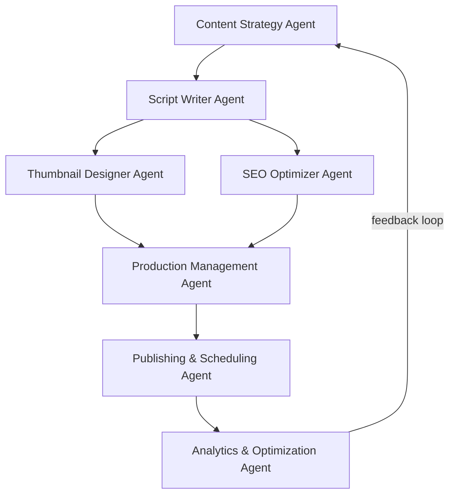
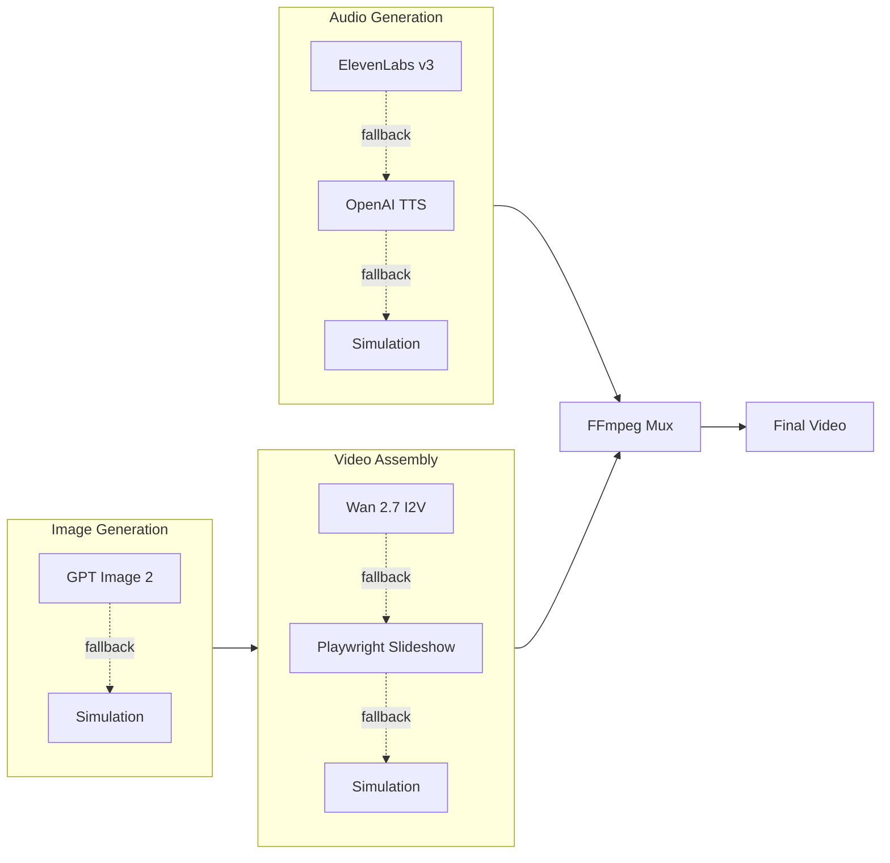

# YouTube Automation Agent

## What's New in v2.0

- **Model upgrades across the board** — GPT-5.5 / GPT-5.5 Instant replace GPT-4-turbo, GPT Image 2 replaces DALL-E 3, Gemini 3.5 Flash/Pro replace Gemini 1.x, ElevenLabs Eleven v3 replaces v1, Wan 2.7 replaces Stable Video Diffusion
- **OpenAI SDK v6** — upgraded from v4, along with `@google/genai` v2.9, `replicate` v1.4, `googleapis` v173
- **Revamped setup wizard** — new TTS service picker (OpenAI TTS / ElevenLabs / Azure), ElevenLabs credential setup, updated model selection menus
- **Fixed deprecated API patterns** — OpenAI v3 SDK calls in credential testing replaced with v4+ patterns
- **Dynamic year in content strategy** — no more hardcoded "2025" in trend analysis prompts
- **README rewrite** — developer-focused docs with Mermaid architecture diagrams, no fluff

---

Fully automated YouTube channel management system. AI agents handle content strategy, scriptwriting, thumbnail generation, SEO, publishing, and analytics — end to end, on a daily schedule.

## Architecture



## How It Works

Each agent handles one stage of the pipeline:

| Agent | Role |
|-------|------|
| **Content Strategy** | Analyzes YouTube trends, identifies topics, plans content calendar |
| **Script Writer** | Generates scripts with hooks, storytelling, CTAs |
| **Thumbnail Designer** | Creates thumbnails, runs A/B variations |
| **SEO Optimizer** | Keywords, titles, descriptions, tags |
| **Production** | Coordinates TTS audio, image assets, video assembly |
| **Publishing** | Uploads, schedules, manages playlists |
| **Analytics** | Tracks performance, feeds insights back to strategy |

## AI Providers

### OpenAI (recommended)

- **Language**: GPT-5.5 / GPT-5.5 Instant
- **Images**: GPT Image 2
- **TTS**: GPT-4o-mini-tts
- **Cost**: ~$0.05–0.20 per video

### Google Gemini (free tier)

- **Language**: Gemini 3.5 Flash / Gemini 3.5 Pro
- **Cost**: Free for most usage volumes

### Other integrations

- Anthropic Claude (`claude-opus-4-8`, `claude-haiku-4-5`)
- ElevenLabs (premium TTS with Eleven v3)
- Replicate (Wan 2.7 video generation)
- Local models via Ollama
- Any OpenAI-compatible API

## Quick Start

```bash
git clone https://github.com/darkzOGx/youtube-automation-agent.git
cd youtube-automation-agent
npm install
cp .env.example .env
cp config/credentials.example.json config/credentials.json
npm run setup   # interactive credential wizard
npm start
```

Dashboard runs at `http://localhost:3456`.

### Prerequisites

- Node.js 18+
- Google account (YouTube Data API — free)
- At least one AI provider key (OpenAI or Gemini)

## Configuration

### API Keys

#### YouTube Data API (required, free)

1. Create a project in [Google Cloud Console](https://console.cloud.google.com/)
2. Enable **YouTube Data API v3**
3. Create an OAuth 2.0 client (Desktop app)
4. Save the JSON as `config/credentials.json`

#### OpenAI

1. Get a key from [platform.openai.com](https://platform.openai.com/)
2. Set `OPENAI_API_KEY` in `.env`

#### Google Gemini

1. Get a key from [Google AI Studio](https://aistudio.google.com/)
2. Set `GEMINI_API_KEY` in `.env`

### Environment Variables

```env
# AI providers (pick one or both)
OPENAI_API_KEY=sk-...
# GEMINI_API_KEY=...

# Optional: premium TTS
# ELEVENLABS_API_KEY=...
# ELEVENLABS_VOICE_ID=...

# Optional: AI video generation
# REPLICATE_API_KEY=...

# App config
NODE_ENV=production
PORT=3456
CHANNEL_NAME=Your Channel Name
TARGET_AUDIENCE=Your target audience
YOUTUBE_REGION=US
DEFAULT_PRIVACY_STATUS=public
```

## Automation Schedule

```mermaid
gantt
    title Daily Pipeline
    dateFormat HH:mm
    axisFormat %H:%M

    section Content
    Generate content (strategy + script + thumbnail + SEO) :06:00, 2h

    section Publishing
    Process publishing queue :crit, 08:00, 14h

    section Analytics
    Collect analytics     :09:00, 1h
    Run optimizations     :22:00, 1h
```



The scheduler runs automatically after `npm start`. Content generation at 06:00, publishing queue processed every 15 minutes, analytics at 09:00, optimization at 22:00. Weekly strategy reviews run on Sundays.

## API

```bash
# health check
curl http://localhost:3456/health

# generate a video on demand
curl -X POST http://localhost:3456/generate \
  -H "Content-Type: application/json" \
  -d '{"topic": "Top 10 Life Hacks", "style": "listicle"}'

# view schedule
curl http://localhost:3456/schedule

# get analytics
curl http://localhost:3456/analytics

# publish a specific content item
curl -X POST http://localhost:3456/publish/:contentId
```

## Production Pipeline



Each stage has graceful fallbacks. If a paid API key isn't configured, the system simulates that step so the rest of the pipeline still runs.

## Extending

### Custom AI provider

```javascript
// utils/ai-service.js
const Anthropic = require('@anthropic-ai/sdk');

class ClaudeAIService {
  constructor(apiKey) {
    this.client = new Anthropic({ apiKey });
  }
  async generateContent(prompt) {
    const message = await this.client.messages.create({
      model: 'claude-opus-4-8',
      max_tokens: 1024,
      messages: [{ role: 'user', content: prompt }]
    });
    return message.content[0].text;
  }
}
```

### Custom content types

```javascript
// agents/content-strategy-agent.js
const contentTypes = {
  'podcast': {
    duration: '10-15 minutes',
    style: 'conversational',
    thumbnail: 'podcast-style'
  },
};
```

## Project Structure

```
youtube-automation-agent/
├── agents/          # one file per agent
├── config/          # credentials, example configs
├── database/        # SQLite schema and access layer
├── data/            # generated content and assets
├── schedules/       # cron-based automation
├── utils/           # AI service wrappers, logging, credential management
├── workflows/       # daily and weekly pipeline orchestration
├── uploads/         # temporary upload staging
└── index.js         # Express server + agent initialization
```

## Troubleshooting

| Problem | Fix |
|---------|-----|
| YouTube API quota exceeded | Check quotas in Google Cloud Console; reduce posting frequency |
| Content generation failed | Verify API keys and credits; check `logs/` |
| Publishing failed | Re-authenticate YouTube OAuth tokens; check video format |

Enable debug logging:

```bash
NODE_ENV=development DEBUG_MODE=true npm start
```

## Contributing

1. Fork the repo
2. Create a feature branch
3. Make changes and add tests
4. Submit a PR

```bash
git clone <your-fork>
cd youtube-automation-agent
npm install
npm run dev
```

## License

MIT — see [LICENSE](LICENSE).

## Acknowledgments

- [OpenAI](https://openai.com/) — GPT-5.5, GPT Image 2, GPT-4o-mini-tts
- [Google](https://ai.google.dev/) — YouTube Data API, Gemini 3.5
- [ElevenLabs](https://elevenlabs.io/) — Eleven v3 TTS
- [Replicate](https://replicate.com/) — Wan 2.7 video generation

---

> This tool is for legitimate content creation. Comply with [YouTube's Terms of Service](https://www.youtube.com/t/terms) and Community Guidelines.
